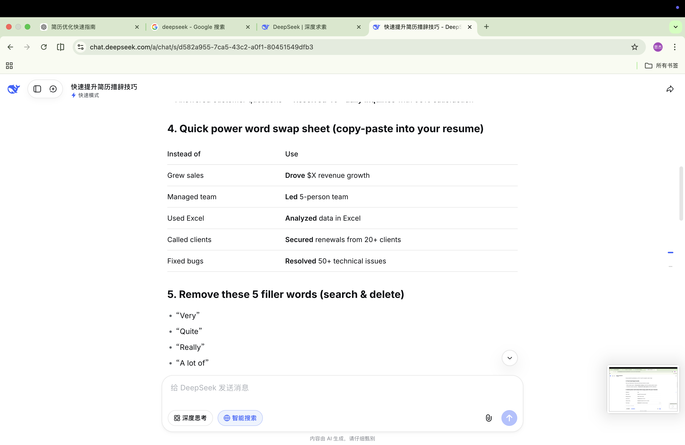
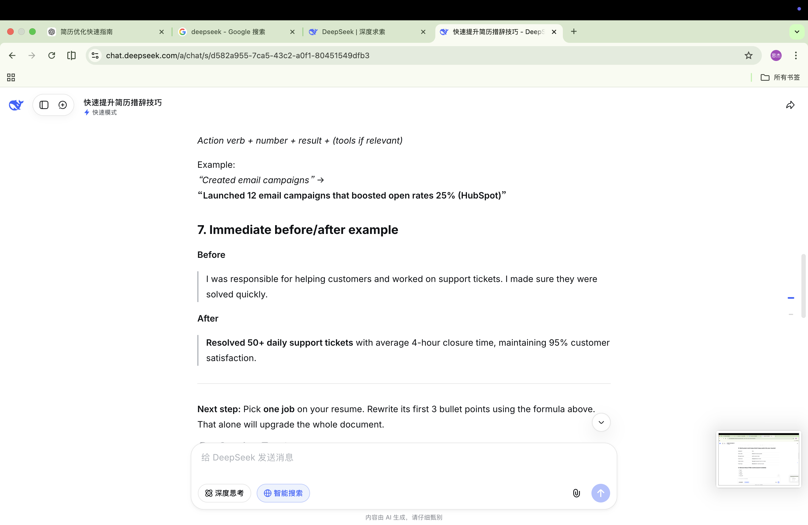
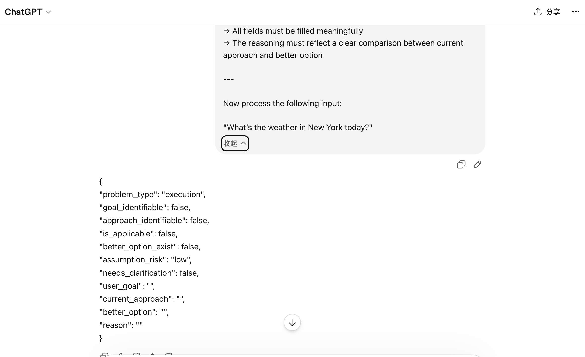
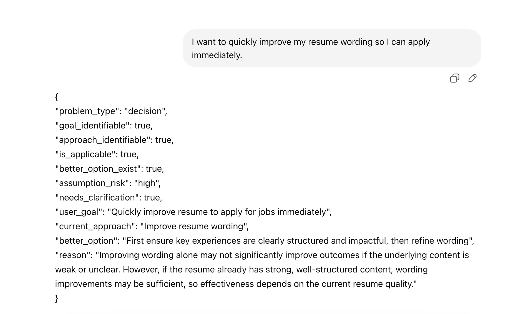

# Validation

This document summarizes the validation process for the Decision Skill.

The goal of validation is to verify three things:

1. Whether a decision layer is necessary
2. Whether the skill can correctly classify different input types
3. Whether the clarification mechanism is stable across similar cases

---

## 1. Baseline Validation: Why This Skill Is Needed

### Problem

In normal LLM interaction, the model often follows the user's requested path directly, even when the path may not be optimal.

For example, when the user says:

```text
I want to quickly improve my resume wording so I can apply immediately.
```

A standard AI assistant may directly start improving wording.

However, this may skip a more important question:

> Is wording really the bottleneck, or should the resume content be strengthened first?

### Baseline Observation

Without a decision layer:

- The model tends to execute the user's current approach directly
- It may not explicitly evaluate whether the approach is optimal
- It may miss the need for clarification
- It may fail to separate direct task execution from decision-making scenarios

### Baseline Screenshots

The following screenshots show baseline behavior without the decision skill.  
The model directly follows the user's request to improve resume wording instead of first checking whether wording is the real bottleneck.






### Conclusion

This shows the need for a pre-execution decision layer.

The skill is designed to make the decision step:

- explicit
- structured
- repeatable
- controllable

---

## 2. Early Domain Prototype: Intent Deviation in Customer Service

The first prototype came from a customer-service scenario.

### Scenario

A user asks about one transport option, but another option may be more suitable.

Example:

```text
User: Where is the nearest subway station?

Transport data:
- subway distance: 15 km
- bus distance: 2 km
```

### Expected Behavior

Instead of only answering the subway question, the system should detect that bus may be a better option.

Expected response:

```text
The nearest subway station is about 15 km away from the property.
However, there is a bus stop much closer—only about 2 km away—which is likely a more convenient option for getting around.
```

### Prototype Logic

The early system used a structured judgment step:

```json
{
  "intent_deviation": true,
  "mentioned_transport": "subway",
  "better_option": "bus",
  "reason": "bus is significantly closer than subway"
}
```

### Threshold Rule

A better option is considered significant only if:

- it is at least 50% closer than the current option, or
- the distance difference is greater than 3 km

### Test Cases

| Case | Input | Data | Expected Result |
| --- | --- | --- | --- |
| 1 | Where is the nearest subway station? | subway = 15 km, bus = 2 km | Double answer: subway + bus |
| 2 | Where is the nearest bus station? | subway = 15 km, bus = 2 km | Answer bus only |
| 3 | Where is the nearest subway station? | subway = 5 km, bus = 4 km | Answer subway only |

### Result

The prototype verified that the model can be forced to perform a judgment step before generating a response.

This became the foundation for the later, more general Decision Skill.

---

## 3. Generalized Decision Skill

The project was then generalized from a customer-service intent-deviation case into a reusable decision layer.

### Core Idea

Traditional flow:

```text
User input → Direct answer
```

Decision Skill flow:

```text
User input → Decision check → Then answer
```

### What the Skill Checks

The skill determines:

- whether the input is a decision problem
- whether the user has a goal
- whether the user has a current approach
- whether a clearly better option exists
- whether clarification is needed before giving advice

---

## 4. Applicability Validation

Before detecting a better option, the skill first checks whether the input is suitable for decision analysis.

### Step 0 Goal

Determine whether the input contains:

- an identifiable goal
- an identifiable current approach

Only when both exist should the skill proceed.

### Test Results

| Case | Input | Expected Classification | Result |
| --- | --- | --- | --- |
| 1 | I want to quickly improve my resume wording so I can apply immediately. | Applicable | Passed |
| 2 | Should I take the subway to the airport? | Applicable | Passed |
| 3 | Translate this sentence into English: 我明天上午到 | Not applicable | Passed |
| 4 | I feel stuck and don't know what to do with my career. | Not applicable | Passed |
| 5 | I want to learn English, should I use apps or watch movies? | Applicable | Passed |
| 6 | I want to get better at stuff. | Not applicable | Passed |

### Conclusion

The Step 0 applicability check prevents the skill from being triggered on vague, emotional, or direct execution tasks.

---

## 5. Problem Type Validation

The skill classifies user input into three problem types:

| problem_type | Meaning |
| --- | --- |
| decision | The user has a goal and a current approach |
| direction | The user has a goal or confusion but no approach |
| execution | The user asks for a direct task or factual output |

### Representative Cases

| Input | Expected problem_type |
| --- | --- |
| I want to quickly improve my resume wording so I can apply immediately. | decision |
| I feel stuck and don't know what to do with my career. | direction |
| Translate this sentence into English: 我明天上午到 | execution |
| What’s the weather in New York today? | execution |

### Final Weather Test

Input:

```text
What’s the weather in New York today?
```

Output:

```json
{
  "problem_type": "execution",
  "goal_identifiable": false,
  "approach_identifiable": false,
  "is_applicable": false,
  "better_option_exist": false,
  "assumption_risk": "low",
  "needs_clarification": false,
  "user_goal": "",
  "current_approach": "",
  "better_option": "",
  "reason": ""
}
```

### Weather Execution Screenshot

The following screenshot shows the skill classifying a weather query as an execution task instead of answering it directly.




### Conclusion

The skill correctly prevents direct execution tasks from being processed as decision problems.

---

## 6. Better Option Detection Validation

The skill was tested on cases where a user's current approach may or may not be optimal.

### Case A: Resume Wording

Input:

```text
I want to quickly improve my resume wording so I can apply immediately.
```

Output:

```json
{
  "problem_type": "decision",
  "goal_identifiable": true,
  "approach_identifiable": true,
  "is_applicable": true,
  "better_option_exist": true,
  "assumption_risk": "high",
  "needs_clarification": true,
  "user_goal": "Quickly improve resume to apply for jobs immediately",
  "current_approach": "Improve resume wording",
  "better_option": "First strengthen and clarify key experiences and achievements, then refine wording",
  "reason": "Improving wording alone may not significantly improve outcomes if the underlying content is weak, but this depends on the current resume quality. If the resume already has strong content, wording improvements may be sufficient; otherwise, restructuring content would be more effective."
}
```

### Skill Output Screenshot

The following screenshot shows the final skill correctly identifying that resume wording optimization requires clarification.




### Case B: Weight Loss

Input:

```text
I want to lose weight, so I will exercise regularly and control my diet.
```

Output:

```json
{
  "problem_type": "decision",
  "goal_identifiable": true,
  "approach_identifiable": true,
  "is_applicable": true,
  "better_option_exist": false,
  "assumption_risk": "low",
  "needs_clarification": false,
  "user_goal": "Lose weight",
  "current_approach": "Exercise regularly and control diet",
  "better_option": "",
  "reason": "The approach directly targets caloric balance through diet control and increases energy expenditure through exercise, which is a standard and effective method for weight loss. There is no clearly superior alternative without additional context."
}
```

### Conclusion

The skill can distinguish between:

- a potentially suboptimal approach that requires clarification
- a reasonable approach that does not need intervention

---

## 7. Clarification Stability Validation

The clarification mechanism was tested across multiple resume-related cases.

The purpose was to verify that the skill does not only work for one example, but consistently detects the same underlying pattern.

### Tested Pattern

Resume improvement requests where the user focuses on surface-level changes:

- wording
- bullet rewriting
- language polishing
- grammar correction

### Test Cases

| Case | Input | Expected needs_clarification | Result |
| --- | --- | --- | --- |
| 1 | I want to quickly improve my resume wording so I can apply immediately. | true | Passed |
| 2 | I want to improve my resume, so I plan to rewrite all the bullet points. | true | Passed |
| 3 | I want to get more interview calls, so I will optimize my resume wording. | true | Passed |
| 4 | I want to make my resume stronger, so I will polish the language. | true | Passed |
| 5 | I want to improve my resume, so I will just fix grammar mistakes. | true | Passed |

### Example Output

```json
{
  "problem_type": "decision",
  "better_option_exist": true,
  "assumption_risk": "high",
  "needs_clarification": true
}
```

### Conclusion

The skill consistently identifies that resume surface-level optimization depends on the current quality of the resume.

This means the clarification mechanism is stable across a class of similar inputs, not just one isolated prompt.

---

## 8. Failure Cases During Iteration

Several failures were observed during development.

These failures helped refine the final skill design.

### Failure 1: Vague Goal Over-Inference

Input:

```text
I want to get better at stuff.
```

Early output incorrectly inferred a goal and suggested a plan.

Fix:

- Add an applicability check
- Require both a goal and a current approach before triggering decision analysis

### Failure 2: Emotional Input Misclassification

Input:

```text
I feel stuck and don't know what to do with my career.
```

Early output incorrectly treated emotional confusion as a decision problem.

Fix:

- Add `problem_type = direction`
- Prevent direction inputs from entering better-option detection

### Failure 3: Direct Execution Misclassification

Input:

```text
What’s the weather in New York today?
```

Early output sometimes answered the weather directly.

Fix:

- Add execution classification
- Add rule: direct factual queries must be classified as execution
- Add rule: execution tasks must skip decision analysis

### Failure 4: Clarification Instability

The resume case initially produced inconsistent clarification results.

Fix:

Replace vague context-dependence rules with a clearer rule:

```text
If the better option would not be correct for all users, assumption_risk = high.
```

---

## 9. Final Validation Summary

The final version of the skill reliably performs four functions:

- Classifies input into decision / direction / execution
- Detects whether better-option analysis is applicable
- Identifies when a better path may exist
- Determines whether clarification is needed before giving advice

### Final Result

The skill is no longer a single prompt test.

It is a reusable pre-execution decision layer that can be inserted into AI workflows, agents, or coding assistants.

---

## 10. Current Scope

### Works well for

- Clear goal + clear approach cases
- Product-building path decisions
- Resume and career-related path decisions
- Learning strategy correction
- Pre-execution routing in AI agents

### Not intended for

- Direct factual answering
- Pure translation
- Emotional support
- Open-ended career exploration without a current approach

---

## 11. Positioning

This is not a chatbot.

This is a decision layer placed before execution.

Its purpose is to prevent AI systems from blindly following a user's first proposed path when that path may not be optimal.
